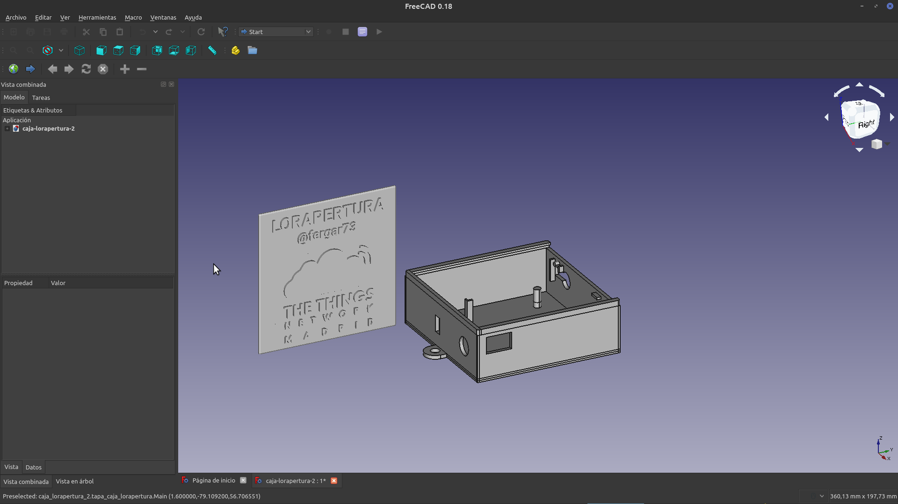

## LORAPERTURA
The lorapertura device lets you know when a door is open or closed and report its status the global open Lorawan network [The Things Network](https://www.thethingsnetwork.org/). It offers information on temperature, pressure and humidity of the place where it is installed as well as the luminosity of the space. 
The [project presentation](./presentacion/lorapertura-ttnmad.pdf) for aditional details. 
- [Spanish README file](README.md)

### Hardware
List of components for the device
- Device TTN Madrid: View this repo  [documentation]( https://github.com/IoTopenTech/Nodo_TTN_MAD_V2) for full details and follow the [guide](https://github.com/IoTopenTech/Nodo_TTN_MAD_V2/blob/master/Montaje%20nodo%20TTN%20MAD%20v2_2%20basico.pdf) to build it from scratch.
- Magnetic door Sensor
- Bosch BME280 Sensor 
- TEMT6000 Sensor  

The presentation indicates the way to connect the sensors to the TTN Madrid node.

### Software
Two arduino sketches are provided in the software directory depending on the preferred way to authenticate the device (OTAA OR ABP) in [The Things Network](https://www.thethingsnetwork.org).

It's been used Arduino IDE to develop this project, more details available: [SW-Arduino-IDE](software/SW-Arduino-IDE-EN.md)

### 3D Device Enclosure
An indoor box is proposed together with its cover to fix the device to the wall in the box-3d folder. This enclosure has been developed using [freecad](https://www.freecadweb.org)

### Contributions
Contributions can be made to the project, you can fork locally and raise the pull-request with the improvements.

### Data visualization 
Presentation and control layer of the lorapertura device has been built in [myiotopentech](https://my.iotopentech.io/) which is based on the open source platform [thingsboard](https://thingsboard.io/) that allows managing the collection of data from IoT devices, its processing and visualization.
Here is [the detailed information of myiotopentech](https://github.com/IoTopenTech/myIoTopenTech). The internal name of the lorapetura device is TTNMAD-DOOR-BME280-TEMT6000 and below the main panel showing the loraperture data

### License
LORAPERTURA © 2021 by fergar73 is licensed under CC BY-NC-SA 4.0 [Creative Commons Attribution-NonCommercial-ShareAlike 4.0 International License](http://creativecommons.org/licenses/by-nc-sa/4.0/)
 
### Acknowledgment
This project has been possible thanks to the extraordinary work being done by the community [The Things Network Madrid](https://www.thethingsnetwork.org/community/madrid/)
 