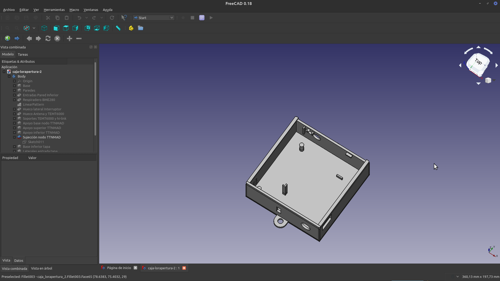
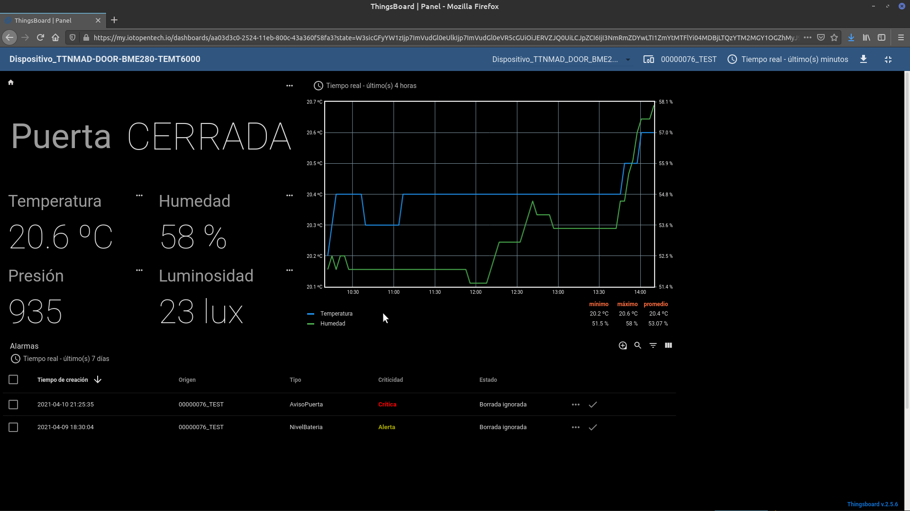

## LORAPERTURA
El dispositivo lorapertura permite saber cuando una puerta está abierta o cerrada e informar de su estado a traves de la red Lorawan abierta y global [The Things Network](https://www.thethingsnetwork.org). Ofrece información de temperatura, presión y humedad del sitio donde esté instalado así como la luminosidad del espacio.
En la [presentación del proyecto](./presentacion/lorapertura-ttnmad.pdf) puedes consultar algunos detalles adicionales. 
- [English README file](README-EN.md)

### Hardware
Listado de componentes necesarios para la construcción del dispositivo
- Nodo TTN Madrid: Consulta esta  [documentación]( https://github.com/IoTopenTech/Nodo_TTN_MAD_V2) y sigue los pasos de esta [guía](https://github.com/IoTopenTech/Nodo_TTN_MAD_V2/blob/master/Montaje%20nodo%20TTN%20MAD%20v2_2%20basico.pdf) para construirlo.
- Sensor magnético puerta abierta
- Sensor Bosch BME280
- Sensor TEMT6000 

En la presentacion se indica la forma elegida de conectar los sensores al nodo TTN Madrid.

### Software
Se proporcionan dos programas ".ino" de arduino en el directorio del software dependiendo de la forma preferida (OTAA O ABP) de conectar el dispositivo a [The Things Network](https://www.thethingsnetwork.org).

Se ha utilizado el Arduino IDE para este proyecto, los detalles se indican en [SW-Arduino-IDE](SW-Arduino-IDE.md)

### 3D - Caja Dispositivo 
Se propone una caja de interior junto con su tapa para fijar el dispositivo a la pared en la carpeta caja-3d. Este dispositivo se ha realizado utilizando [freecad](https://www.freecadweb.org)

### Visualización de Datos
La capa de presentación y control del dispositivo lorapertura se ha realizado utilizando [myiotopentech](https://my.iotopentech.io/) que está básado en la plataforma de código abierto [thingsboard](https://thingsboard.io/) que permite gestionar la recolección de datos de dispositivos de IoT, su procesamiento y visualización. 
Aquí está [la información detallada de myiotopentech]( https://github.com/IoTopenTech/myIoTopenTech). El nombre interno del dispositivo lorapetura es TTNMAD-DOOR-BME280-TEMT6000 y a continuación se muestra el panel principal que muestra los datos de lorapertura

### Contribuciones
Se pueden realizar contribuciones al proyecto, puedes hacer un fork en local y plantear los pull-request con las mejoras realizadas.

### Licencia
LORAPERTURA © 2021 por fergar73 esta bajo licencia CC BY-NC-SA [Creative Commons Reconocimiento-NoComercial-CompartirIgual 4.0 Internacional License](http://creativecommons.org/licenses/by-nc-sa/4.0/)
 
### Agradecimientos
Este proyecto ha sido posible gracias a la extraordinaria labor que se está realizando la comunidad [The Things Network Madrid](https://www.thethingsnetwork.org/community/madrid/)
 