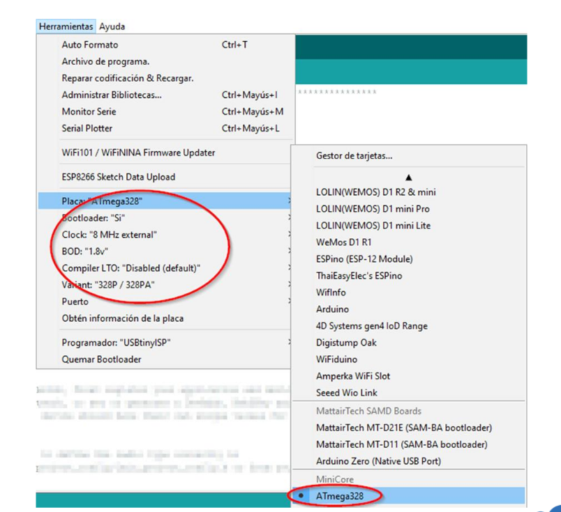

## Programación con Arduino IDE

Puedes instalar el arduino IDE disponible en [arduino.cc](https://www.arduino.cc). Este proyecto ha sido desarrollado con la versión 1.8.13.

### Dependencias

Este proyecto requiere de la instalación en el arduino IDE de las siguientes librerías. Son necesarias para la compilación y correcto funcionamiento del dispositivo. 

- <lmic.h>             // For the Lorawan comunication - Release v2.3.2
https://github.com/mcci-catena/arduino-lmic
- <LowPower.h>         // To allow the low power arduino energy  consumption Release v1.6.0
https://github.com/rocketscream/Low-Power
- <forcedClimate.h>    // Getting BME280 data Release v3.0.0
https://github.com/JVKran/Forced-BME280
- <YetAnotherPcInt.h>  // To choose the port for the door control interruption Release v2.1.0
https://github.com/paulo-raca/YetAnotherArduinoPcIntLibrary 
- <CayenneLPP.h>       // Cayenne Library for the payload format Release v1.0.1
https://github.com/ElectronicCats/CayenneLPP

Una vez tengas instalado y descargado el repositorio en el directorio software está el código disponible para compilarlo y subirlo al dispositivo lorapertura.
Recuerda que debes rellenar los datos concreto de tu dispositivo en FILLMEIN dependiendo de la configuración (OTAA o ABP) de tu dispositivo en [The Things Network](https://www.thethingsnetwork.org)

Lugar del código ABP donde remplazar el FILLMEIN 
```c
// LoRaWAN NwkSKey, network session key
static const PROGMEM u1_t NWKSKEY[16] = { FILLMEIN } ;`

// LoRaWAN AppSKey, application session key
static const u1_t PROGMEM APPSKEY[16] = { FILLMEIN } ;

// LoRaWAN end-device address (DevAddr)
// See http://thethingsnetwork.org/wiki/AddressSpace
// The library converts the address to network byte order as needed.
static const u4_t DEVADDR = FILLMEIN ; // <-- Change this address for every node!
```

### Select board and upload the binary 

Two options selecting the board depending on the bootloader of the ttnmad node:
If you load the Minicore bootloader as indicated in the doc as optional then select ATmega328 board

otherwise you have to choose the "Arduino Pro or Pro Mini" board.


Then select the port where the board is connected to the computer in Tools > Ports
And finally click on the rounded arrow button on the top to upload the project to the board or go to Program > Upload (Ctl+U)